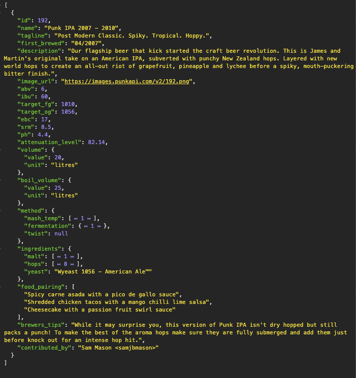
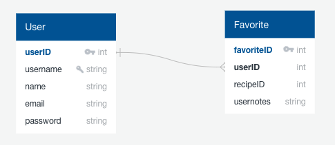

# Beers4U

## Purpose
The main purpose of this website is to be a reference guide for amateur homebrewers (like me) who like to experiment with new beer recipes, and are looking for new ideas. 

A secondary purpose is to provide pairing ideas between beer and food. The pairing would work both ways: given a beer, the website would make suggestions on food pairing; given a food, the website would make suggestions on beer pairing.

## Audience
The website can potentially be visited by homebrewers who are looking for new recipe ideas for their next beer. Other potential visitors include people looking for beer pairing information based on what they will be cooking; or perhaps they have this specific beer at home and are curious about what food would be a good pair to try the beer with.

## Data / API
Making use of the [Punk API](https://punkapi.com/), the website can provide a huge variety/amount of data on beer recipes including, but not limited to: 

* Type of beer (included in the beer name):
	* Pale Ale;
	* Lager; 
	* Pilsner;
* Bitterness Level (measured in IBU);
* Alcohol Level (measured in ABV);
* Image (it can be very appealing - mouth watering, if you ask me 😋);
* Ingredients used:
	* Hops;
	* Malts;
	* Yeast;
* Food Pairing

Here's an example of what a JSON response from the API looks like: 

## Aproach

### Database Schema
The application will make use of two databases: a User and a Favorite database, according to the schema below. The recipeID column in the Favorite database will be an integer that references the beer recipe ID obtained from the API.

### Potential issues
Because the database will not store any beer recipe information directly (except for the ID), the website will completely rely on the API availability to be able to display information to users and ultimately work properly.

### Sensitive information
The database will store user password that will be encrypted with bcrypt before it's stored in the database.

### Functionality
The application will allow any user to view basic/advanced information on beer recipes, such as:

* Name;
* Tags;
* Image (if available);
* Alcohol volume (percentage);
* Bitterness;
* Food pairing;
* Ingredients required to brew the beer;
* Brewer's tips

In addition to all the above mentioned functionalities, all registered/logged in users will be able to mark recipes as favorites, and add their own notes on each of these recipes for future reference. Registered/logged in users will also be able to search for beers that pair with specific food.

### User Flow / UX
Once in the home page, users will have the option to register, log in, or use the website without the extra features that are only available to registered/logged in users. Regardless of their choice, they will be presented with a basic search interface allowing them to perform searches based on the beer name (the name includes the type of beer - lager, pilsner, pale ale, etc.), bitterness (since the search is made using IBU - an integer - the website will have dropdowns with ranges for better experience), alcohol volume, and food pairing. If the user chooses to perform an *advanced search* (more directed towards homebrewers), the search can then also be performed based on the ingredients (malt, hop, and yeast). If the user is registered/logged in, the search for beers that match specific food will be enabled. Search results would be displayed in a collapsed format, allowing the user to expand as they wish.

### More than just CRUD
The website will offer a customized experience not only for users who are curious about different types of beer (looking for new beers to buy), but also for users who are interested in better matching their meal to the beer they already have, not to mention homebrewers willing to explore new recipes, and users interested in learning which beers would be a good match for the food being served.
